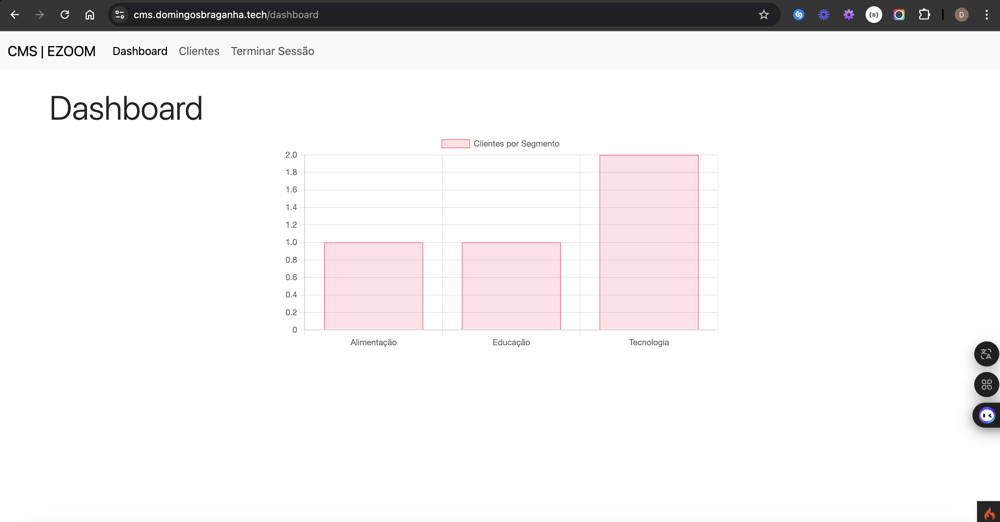

# CMS Project

## Descrição

Este é um projeto de CMS (Sistema de Gerenciamento de Conteúdo) desenvolvido com CodeIgniter 4.

## Requisitos do Servidor

- PHP versão 8.1 ou superior
- MySQL 5 ou Superior

## Instalação

1. Clone o repositório para o seu ambiente local:
    ```sh
    git clone https://github.com/Dumilson/cms-with-codeingnter.git
    cd cms-with-codeingnter
    ```

2. Instale as dependências do Composer:
    ```sh
    composer install
    ```

3. Copie o arquivo [env](http://_vscodecontentref_/0) para [.env](http://_vscodecontentref_/1) e configure as variáveis de ambiente conforme necessário:
    ```sh
    cp env .env
    ```

4. Configure o banco de dados no arquivo [.env](http://_vscodecontentref_/2):
    ```env
    database.default.hostname = 127.0.0.1
    database.default.database = cms_test
    database.default.username = root
    database.default.password = 
    database.default.DBDriver = MySQLi
    database.default.DBPrefix =
    database.default.port = 3306
    ```

5. Execute as migrações para criar as tabelas no banco de dados:
    ```sh
    php spark migrate
    ```

6. Execute os seeders para popular o banco de dados com dados iniciais:
    ```sh
    php spark db:seed DatabaseSeeder
    ```

## Executando o Projeto

1. Inicie o servidor de desenvolvimento:
    ```sh
    php spark serve
    ```

2. Abra o navegador e acesse:
    ```
    http://localhost:8080
    ```

# Processo de Deploy

O projeto está configurado para deploy automático usando GitHub Actions. O fluxo de trabalho é o seguinte:

1. Todas as atualizações devem ser feitas na branch `develop`.
2. Quando as alterações estiverem prontas para ir para produção, abra um Pull Request da branch `develop` para a branch `master`.
3. Quando o Pull Request for aprovado e mesclado na branch `master`, o GitHub Actions iniciará o processo de deploy automaticamente.

### Link de Produção

A documentação da API em produção está disponível em: https://cms.domingosbraganha.tech/


